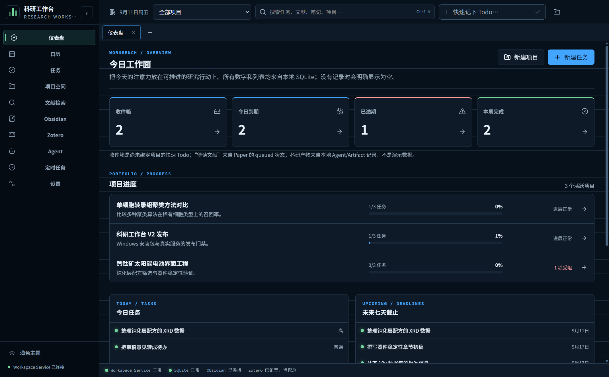
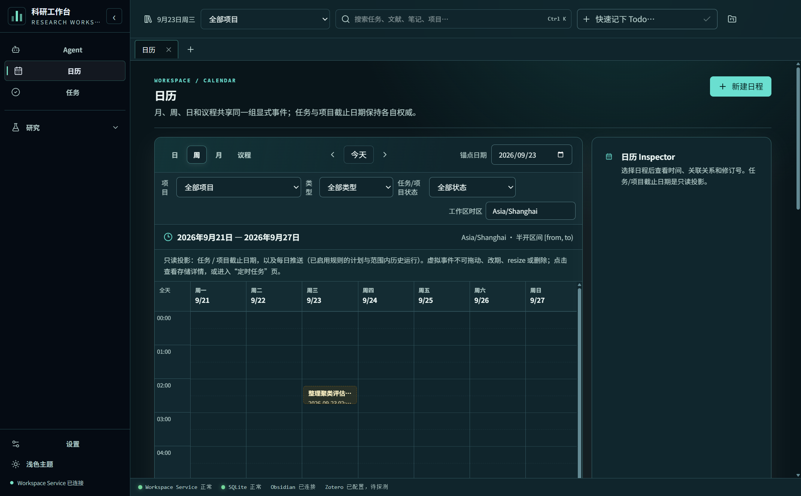
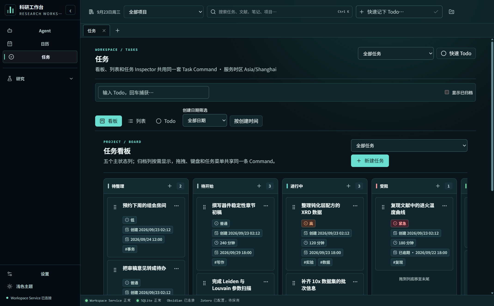
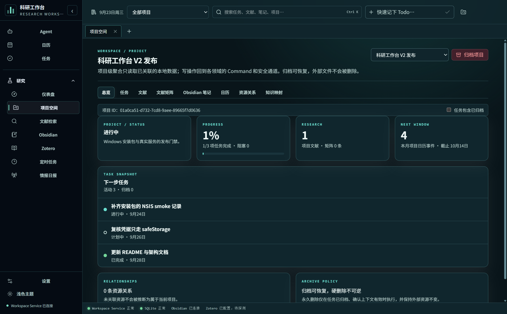
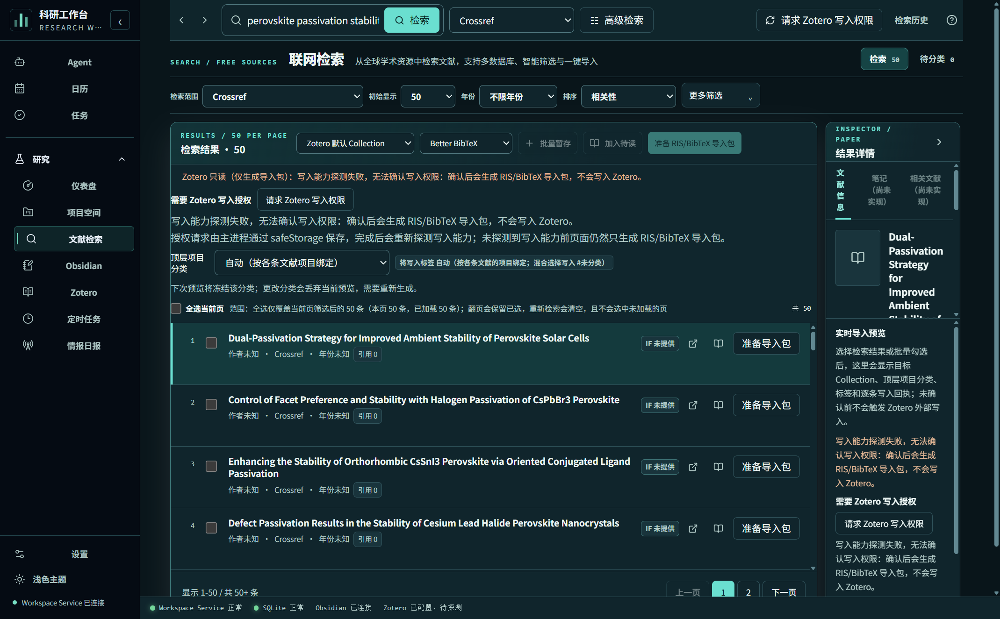
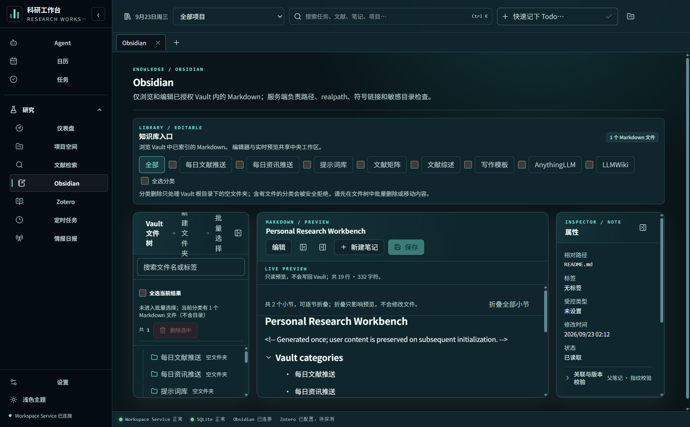
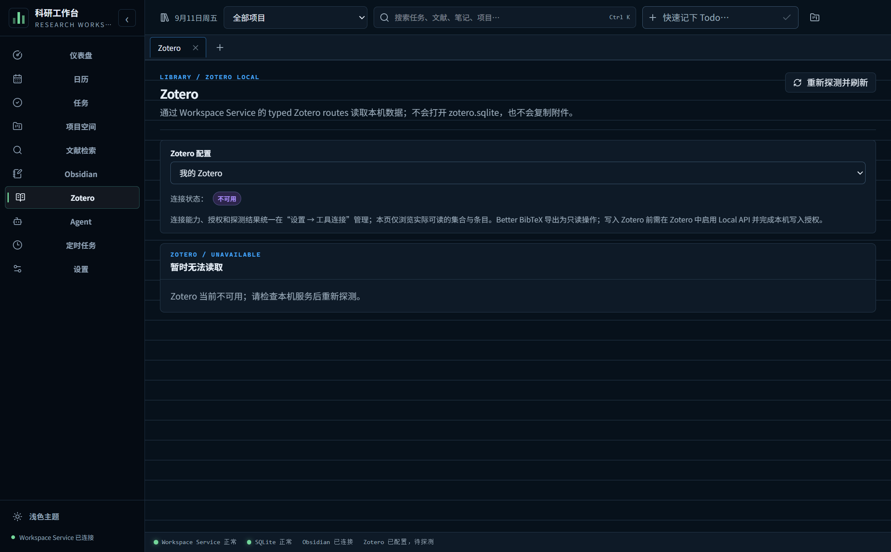
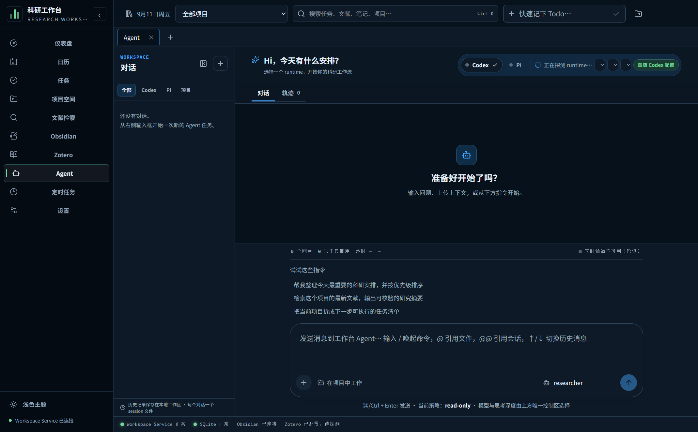
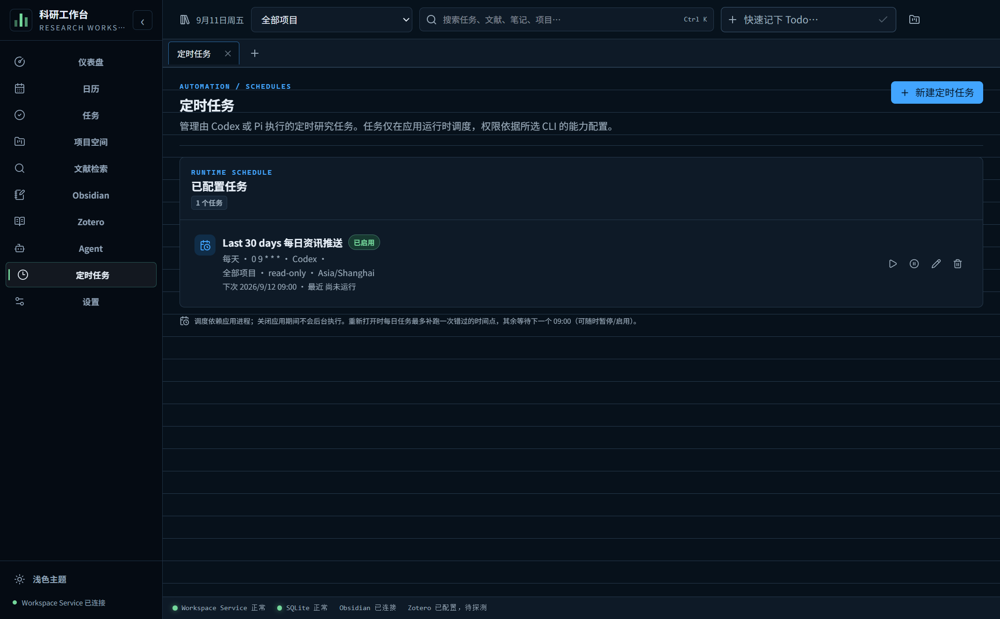
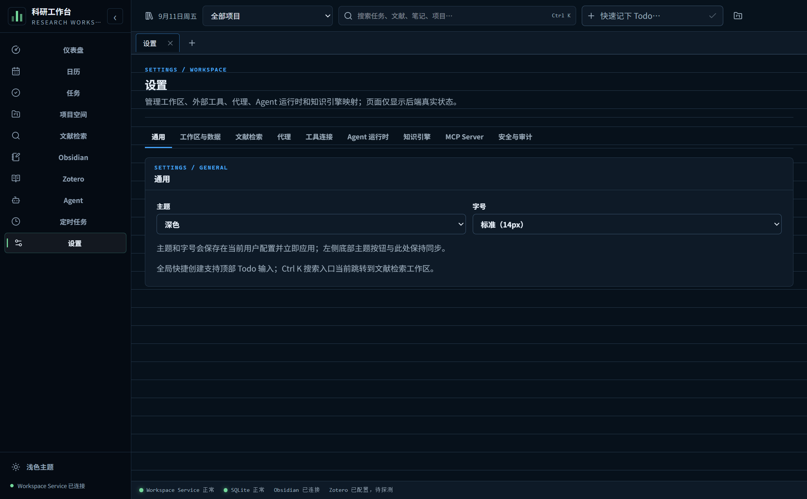

# Personal Research Workbench

Windows 本地优先的个人科研工作台。Electron + React 19 桌面端，TypeScript 全栈，SQLite 为唯一权威数据源；把任务、日历、项目空间、文献检索、Obsidian、Zotero、Agent 运行时和本机 MCP 连接在同一个本地 Workspace Service 后面。

**不联网也能用**：任务、日历、项目、笔记和已导入文献全部存本地 SQLite；联网检索、Zotero Local API 和 AI 运行时是可选增强。

| | |
| --- | --- |
| 平台 | Windows 10/11 x64（NSIS 安装包） |
| 技术栈 | Electron 43.4.1、React 19.2.8、electron-vite 5.0.0、TypeScript |
| 数据 | SQLite（`better-sqlite3` 13.0.3 + Drizzle 0.45.2），22 个版本化 migration |
| AI | 固定 `@earendil-works/pi-ai` 0.84.1（MIT），凭据走应用自有 `safeStorage` |
| 构建 | Node.js ≥ 24、pnpm 11.5.2 |

> 截图说明：下方所有界面截图由 `node scripts/capture-readme-shots.cjs` 在**隔离的临时用户目录**中自动生成，业务数据是通过真实 `window.workbench.v2` 命令面写入的**合成示例数据**（虚构项目、任务、日历与文献），不是任何真实用户的资料。文献检索页为一次真实 Crossref 查询的公开书目结果；Zotero 页展示的是**未连接本机服务时的状态**。证据见 [`docs/assets/screenshots/CAPTURE-REPORT.md`](docs/assets/screenshots/CAPTURE-REPORT.md)。

## 界面总览

十个一级页面共享同一套 Shell：左侧导航、项目上下文切换、全局 Quick Todo、顶部工作区 Tabs、右侧 Inspector 和底部服务状态栏。

### 仪表盘



今日工作面把「今天该做什么」压缩成一屏：收件箱、今日到期、已逾期、本周完成四个计数，下面并列今日任务、未来 7 天任务、待读文献、最近科研产物和 Agent 收件箱五个列表。所有数字来自本地 SQLite，没有记录时明确显示为空态，不使用演示卡片填充。

### 日历



日、周、月、议程四种范围共享同一组显式事件。左侧按项目、事件类型（日程／里程碑／论文精读／实验／会议／投稿返修／截止日期）、任务与项目状态、以及工作区时区筛选；任务和项目的截止日期以**只读投影**的形式叠加在网格上，点击可跳回任务本身。日历标记（markers）可在空白处右键新增。

### 任务



看板、列表和 Todo 三种视图，加上右侧任务 Inspector，共用同一套 Task Command。看板有五个主状态列（待整理／待开始／进行中／受阻／已完成），归档列按需显示；卡片支持拖拽排序、键盘操作和右键菜单。可按项目过滤、按创建时间做日期筛选（今天／明天／未来 7 天／已逾期／无日期／自定义范围），并支持优先级、预计工时、标签和批量归档／恢复／永久删除。

### 项目空间



项目级聚合视图，八个标签页：总览、任务、文献、文献矩阵、Obsidian 笔记、日历、资源关系、知识映射。聚合只读取已关联的本地数据；任何写操作都回到对应领域的 Command 与安全通道。归档项目可恢复，且不会删除任何外部文件。

### 文献检索



联网检索工作区，可并行查询 Crossref、OpenAlex、PubMed、arXiv、Semantic Scholar 和 Google Scholar（scholarly）。结果支持按年份、影响因子和引用指标排序，分页显示（10／20／50），并可按项目分配。感兴趣的结果先进入「待分类」暂存区，再从暂存区**预览后**导入 Zotero；也可以导出 Better BibTeX 或 RIS。右侧 Inspector 显示文献信息、Zotero 导入状态、DOI 与摘要；其中「笔记」和「相关文献」两个分页目前只有外观，尚未实现交互。

### Obsidian



只浏览和编辑**已授权 Vault** 内的 Markdown；路径、realpath、符号链接和敏感目录检查都在服务端完成。文件树带搜索与全选，编辑器与实时预览共享中央工作区，Inspector 显示相对路径、标签、修改时间、文件指纹校验状态，并可把笔记绑定到项目（写入 frontmatter 的 `projectId` 与 `tags`）。分类删除只处理 Vault 根目录下的空文件夹，含文件的分类会被安全拒绝。

### Zotero



通过 Workspace Service 的 typed Zotero routes 读取本机数据，**不打开 `zotero.sqlite`，也不复制附件**。支持 Local API 与 Web API v3，按 Collection 分页浏览条目、查看只读元数据与附件 locator。写回是独立确认操作：只有在本机写入授权完成后，点击明确确认才会调用 Zotero，失败项逐条返回并保留「重新导入」入口。

> 上图是未连接本机 Zotero 服务时的真实状态；连接成功后本页会列出实际的 Collections 与条目。

### Agent



内置 Codex / Pi 两种 CLI runtime，可切换模型、思考深度和权限模式（截图中为 `read-only` 策略）。一次运行会产生一份**归一化 run ledger**：写入阶段就把 CLI 的原始 JSON 映射成 provider-neutral 记录（含 token 用量、工具调用、reasoning、耗时），因此「对话」和「轨迹」两个视图只是同一份 ledger 的两种投影，而不是各自解析 CLI 输出。运行历史保存在本地工作区，每个对话一个 session 文件。

### 定时任务



用 cron 表达式管理由 Codex 或 Pi 执行的定时研究任务，可绑定项目、权限模式和时区，随时暂停／启用。**调度只在应用进程存活期间运行**；关闭应用期间不会后台执行，重新打开时每日任务最多补跑一次错过的时间点。

每个到点时间点先写一条 occurrence 记录再推进游标（同一事务），因此重复的 30 秒 tick、重复点击「立即运行」和启动补跑都只会产生一次执行；应用在时间点执行期间被关闭的遗留记录会结算为「错过」并保留原因。页面底部「最近运行」列出每次运行的状态、时间点来源、阻断/失败原因、Artifact 与 Obsidian 投递结果（已写入路径或跳过原因）；失败/阻断的时间点可以按该规则记录的权限与审批策略重试，不会以更高权限重放旧运行。远程通知渠道（Telegram/Email/Webhook）本阶段不启用。

### 设置



九个分组：通用、工作区与数据、文献检索、代理、工具连接、Agent 运行时、知识引擎、MCP Server、安全与审计。页面只显示后端真实状态；工具连接、授权与探测结果统一在这里管理。

## 核心能力

- **V2 Shell**：项目上下文、Quick Todo、工作区 Tabs、Inspector、底部服务状态栏、深色蓝黑主题（可切浅色）与字号档位。
- **乐观并发**：所有写命令带 `expectedRevision`，冲突会被拒绝而不是静默覆盖；批量操作返回逐条结果。
- **统一信任边界**：Renderer 没有 Node、SQLite、credential 或泛化 IPC 权限，Preload 只暴露 `window.workbench.v2` 和窄化的 `window.workbench.agent`。
- **共享契约**：所有跨进程 DTO 由 `packages/contracts` 的 Zod schema 定义，在进程边界统一校验。
- **本机 MCP**：内置 stdio Server，通过 token 握手的 named pipe 连接到同一个 Workspace Service，首期提供项目／任务 Resources 和受控工具。
- **服务状态自检**：状态栏实时显示 Workspace Service、SQLite、Obsidian、Zotero 的健康状态。

## 架构

```
Renderer (React, 无 Node)
   │  window.workbench.v2 / window.workbench.agent   (contextBridge)
Preload (窄化 API + Zod 校验)
   │  IPC
Electron Main (窗口、打包隔离、IPC sender 信任)
   │  MessagePort
Core process ── Workspace Service ── SQLite (workspace.sqlite3)
   ├── packages/contracts      共享 Zod 契约与 DTO
   ├── packages/domain         纯领域规则（注入时间与 IO）
   ├── packages/database       schema / migrations / repository
   ├── packages/connectors     Obsidian、Zotero、Notion 适配器
   ├── packages/ai-runtime     pi-ai Provider 与 Cron 调度
   ├── packages/agent-runtime  Codex / Pi 运行与归一化 ledger
   └── packages/workspace-mcp  本机 stdio MCP Server
```

打包后的 Renderer 始终使用本地 `workbench://app` origin；`ELECTRON_RENDERER_URL` 仅用于开发，永不扩大打包版的 IPC sender 信任。打包版的用户目录隔离只接受显式校验过的 `--prw-user-data-dir=<绝对非根路径>`。

## 数据与安全边界

- 只使用 `workspace.sqlite3`；旧 `workbench.sqlite3` 不读取、不删除。
- 只使用 `workspace-secrets.json` 的 V2 credential namespace；旧密钥文件不读取、不物理删除。
- 密钥保存在 Main／Core，用 `safeStorage` 加密，且从日志和测试输出中脱敏；不使用 Pi CLI 或 `~/.pi` 的登录态。
- 外部写回经过 `IntegrationCoordinator` 与适配器 revision 检查，使用稳定 external ID、managed block／field；附件只保留链接。
- 永不写入 `zotero.sqlite` 和 Obsidian `.obsidian/`；永不静默覆盖外部用户文本。
- Agent 的定时与外部写回默认不安全无人值守执行。

## 尚未实现

AnythingLLM／AgentScope／LLMWiki／MOSAIC 的 RAG 与索引执行、Headless 常驻调度、远程 MCP、完整持久化 AI Job／Event／Approval／checkpoint、PDF 与向量检索、富文本引用、三方冲突 UI、durable outbox、无人值守外部写回、备份恢复、代码签名和自动更新仍在后续阶段。

已知的局部未完成项：文献检索 Inspector 的「笔记」与「相关文献」分页只渲染标签页外观，没有绑定交互（见 `features/research/literature.tsx:107`）。

## 开发

前置：Node.js 24+、pnpm 11.5.2、Windows 10/11 x64。

```powershell
pnpm install
pnpm dev            # 启动开发模式
pnpm typecheck      # 全仓库类型检查
pnpm build          # 构建 main / preload / renderer
pnpm package:win    # 构建并用 electron-builder 打出 NSIS x64 安装包
pnpm test:e2e       # 类打包形态的 Electron 端到端 smoke（隔离用户目录）
```

last30days skill 的验证脚本（`--network` / `:app` / `:cli` 会真实联网或调用模型，默认不跑）：

```powershell
pnpm test:last30days           # 解析/诊断/引擎契约（离线，无 --mock）
pnpm test:last30days:network   # 追加一次真实无 key 联网运行
pnpm test:last30days:app       # 启动 Electron 验证 skillKey→run/ledger 路径（blocked 诊断，不调用模型）
pnpm test:last30days:cli       # 真实 Codex/Pi 运行一次 skill（消耗 token，opt-in）
```

测试源码已按用户要求删除，`pnpm test` 不再是验收门禁；当前门禁是 `pnpm typecheck` 与 `pnpm build`。`pnpm test:e2e` 用 Playwright 驱动真实 Renderer／Preload／Core 栈并在临时用户目录运行，但仍不是已安装 NSIS 包的安装 smoke。安装包必须在真实 Windows x64 环境完成独立安装／启动／重启／卸载 smoke，仅构建成功不等于发布就绪。

重新生成 README 截图：

```powershell
pnpm build
node scripts/capture-readme-shots.cjs
```

脚本会在临时目录创建隔离 profile，通过真实命令面写入合成示例数据，逐页截图到 `docs/assets/screenshots/`，并写出 `CAPTURE-REPORT.md` 记录每张图的像素、体积与断言到的示例数据标记。脚本内置两项保护：页面出现失败文案会中止；Zotero 集成会被指向一个无监听的回环端口，确保不会把本机真实文献库拍进公开截图。

## 文档

仓库当前的活跃文档在 `docs/`：

- [开发文档索引](docs/README.md) — 模块状态快照与阅读路径
- [模块计划 00–09](docs/plan)：仪表盘、日历、任务、项目空间、文献检索、Obsidian、Zotero、设置、Agent 运行时、完整需求快照
- [仓库协作规则](AGENTS.md) 与 [角色分工](.agents/roles/README.md)

> 历史架构与数据模型文档已归档且不再随仓库维护，因此这里不再链接它们；共享 Zod 契约（`packages/contracts`）与数据库 migration（`packages/database/src/migrations.ts`）是当前的事实来源。

## 许可

仓库暂未附 LICENSE 文件。
